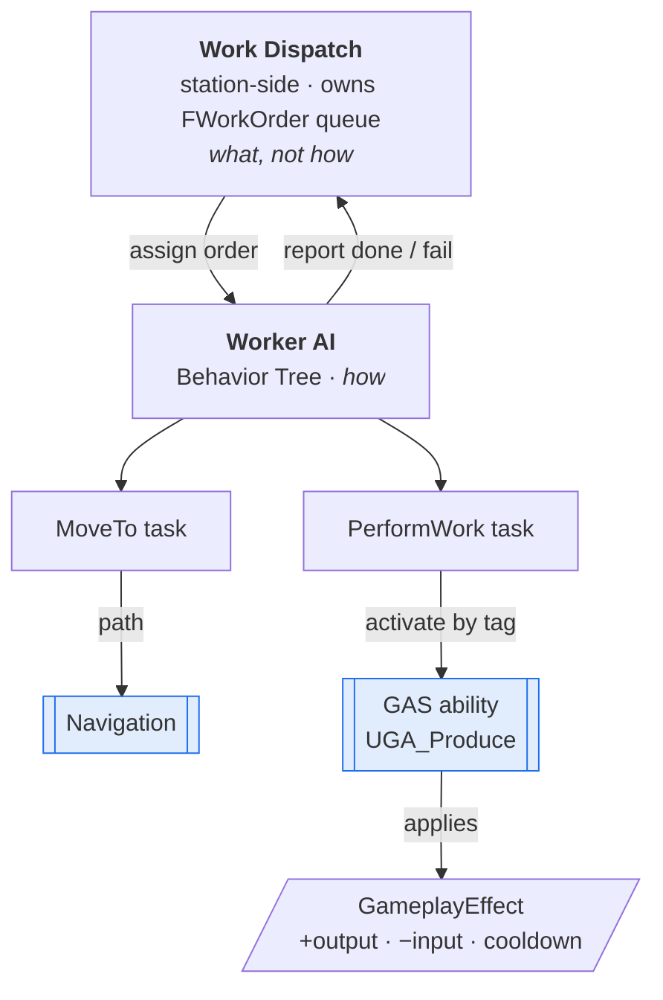

# Automation AI — Creature-Driven Production Line

> "把生物派到工位上，它自己接活、寻路、干活"的自动化生产线技术参照实现：基于 **GAS + 行为树 + 导航** 的可分派 AI 工作单元，四个系统各自独立、以清晰接口协作。
>
> A reference implementation of a **creature-driven automation/production line** — assignable AI workers that pull work orders, path to work sites, and perform production actions. Built on **GAS (Gameplay Ability System)**, **Behavior Trees**, and **Navigation**, with each system behind a clean seam so it can change independently.

<p align="left">
  
  
  
  
</p>

---

## 📌 Context

This distills a feature I built on **_Light of Motiram_** (Tencent, Unreal Engine · C++): players
place production stations and assign creatures to work them; each creature then runs the line
autonomously. The interesting engineering is not any single action — it's the **clean seam between
four systems** (work dispatch, AI, abilities, navigation) so each can be tuned or replaced without
disturbing the others.

> **Related systems I owned on the same title:** the stations these creatures work are build
> pieces from [data-oriented-building](https://github.com/seak123/data-oriented-building), and
> players sail player-built craft in
> [watercraft-physics](https://github.com/seak123/watercraft-physics).

> **This repository is a clean-room reference.** Original code written for portfolio purposes,
> reduced to the load-bearing structure. It contains **no proprietary or third-party source**.

---

## 🎯 The loop



- **Work dispatch** (station-side) owns a queue of `FWorkOrder`s and assigns them to idle workers.
  It knows *what* needs doing, never *how*.
- **Worker AI** (Behavior Tree) owns *how*: pull an order → **MoveTo** the site → **PerformWork**
  → report → loop.
- **GAS** owns the *effect* of work — produce/consume/cooldown is a `GameplayAbility` +
  `GameplayEffect`, so designers tune yields and timings as data.
- **Navigation** is consumed only by the MoveTo task.

Each arrow is an interface, so the ability can be re-tuned without touching dispatch, and the BT
can change without touching GAS.

---

## 🎮 Gameplay: skill-typed work & headcount matching

Beneath the dispatch loop is the gameplay that makes a *production line* feel alive: work is
**typed by skill**, each job needs a **headcount** of workers, and idle creatures are matched
from a pool by the skill they possess.

- **Skill types** — fire (smelt), handwork (craft), water, harvest, haul. A creature only takes
  work it's skilled for.
- **Headcount** — a job can require several workers; the matcher fills each job until it's
  staffed or that skill's pool is empty.
- **Continuous work** — haul and harvest let a worker keep going after finishing, instead of
  dropping back to idle, which avoids constant re-pathing and keeps the line flowing.

```cpp
// WorkSkillMatcher — match idle workers to pending jobs, per skill, filling each job's headcount.
void UWorkSkillMatcher::MatchOnce()
{
    for (auto& Pair : PendingBySkill)
    {
        const EWorkSkill Skill = Pair.Key;
        for (FWorkInfo& Work : Pair.Value)
        {
            FGuid Worker;
            while (!Work.HeadCount.FullyAssigned() && PopAvailableWorker(Skill, Worker))
                AssignWorkerToWork(Work, Worker);        // staff this job from the skill pool
        }
    }
}
```

**Why the loop is driven by jobs, not workers.** With a worker-driven loop, whichever worker is
visited first grabs the nearest job — so multi-worker jobs stay perpetually understaffed, and the
player sees a swarm of creatures fussing over trivial tasks while the big project sits untouched.
Iterating jobs and filling each headcount fixes that by construction.

**Work targets are not one kind of thing** — the most underestimated complexity here. A target may
be an Actor (storage box, mineral node), a foliage instance (wild tree, stump), pure data
(a global crop), or entirely **virtual** — a watering job has no physical entity to walk up to at
all. They have to be abstracted behind one *locatable + validatable* interface so the AI can treat
them uniformly:

```cpp
// 目标类型 / Work target types — Actors, foliage instances, pure data, and virtual targets
enum class EWorkTargetType : uint8
{
    NewPlant, DroppedItem, VirtualDrop, WorkBuild, FoliageInstance, GlobalCrop,
    BuildPiece, ContainerBox, WateringVirtual, RollingLog, Stump, Mineral,
};
```

Two behavioural rules keep a line feeling alive rather than robotic: **continuous work** (haul,
gather) skips the return-to-idle so a hauler doesn't idle and re-path between every two crates;
and **endless work** (collecting honey) has no completion at all — it runs until its conditions
stop holding, e.g. the hive empties or night falls.

See [`src/WorkSkillMatcher.h`](src/WorkSkillMatcher.h). Once assigned, a worker runs the Behavior
Tree — **MoveTo → PerformWork** — described in §1–§3 below.

---

## 1. Work dispatch — separation of "what" from "how"

**Decision.** A work order carries only **where** (`WorkSiteLocation`) and **what** (a Gameplay
`AbilityTag`). Dispatch assigns; it never drives movement or animation.

**Why.** This one boundary is what lets a single worker-AI drive *any* station — a mill, a smelter,
an incubator — just by changing the order's ability tag. It also isolates failure handling: when a
worker reports failure (path blocked, resource gone), dispatch simply re-queues, so a line
**self-heals** instead of silently stalling.

```cpp
// WorkDispatchComponent.cpp — assign pending orders to idle workers; re-queue on failure.
void UWorkDispatchComponent::TickDispatch()
{
    for (TWeakObjectPtr<AWorkerPawn> Worker : RegisteredWorkers)
    {
        if (!Worker.IsValid() || !Worker->IsIdle()) continue;
        if (PendingOrders.IsEmpty()) break;

        FWorkOrder Order; PendingOrders.Dequeue(Order);
        Order.State = EWorkState::Assigned;
        Worker->AssignOrder(Order);              // fire-and-track; worker reports back
        ActiveOrders.Add(Order.Id, Order);
    }
}

void UWorkDispatchComponent::OnWorkerReport(FGuid OrderId, EWorkResult Result)
{
    if (FWorkOrder* Order = ActiveOrders.Find(OrderId))
    {
        if (Result == EWorkResult::Failed) PendingOrders.Enqueue(Order->Reset());  // self-healing
        ActiveOrders.Remove(OrderId);
    }
}
```

See [`src/WorkDispatchComponent.cpp`](src/WorkDispatchComponent.cpp).

---

## 2. MoveTo — the Navigation seam

**Decision.** A Behavior-Tree task that only navigates, and **fails fast** when the site is
unreachable.

**Why.** Robust "can't reach" handling is what keeps a line alive. If a blocked worker hangs on its
order instead of failing, the whole station stalls behind it. Fast-fail hands the order back to
dispatch (§1), which re-queues it for another worker or a later attempt.

```cpp
// BTTask_MoveToWorkSite — navigate to the order's site; unreachable -> fail (dispatch re-queues).
EBTNodeResult::Type UBTTask_MoveToWorkSite::ExecuteTask(UBehaviorTreeComponent& OwnerComp, uint8*)
{
    AWorkerController* C = Cast<AWorkerController>(OwnerComp.GetAIOwner());
    FAIMoveRequest Req(C->GetActiveOrder().WorkSiteLocation);
    Req.SetAcceptanceRadius(Val_WorkReachRadius);

    switch (C->MoveTo(Req).Code)
    {
    case EPathFollowingRequestResult::AlreadyAtGoal:    return EBTNodeResult::Succeeded;
    case EPathFollowingRequestResult::RequestSuccessful:return EBTNodeResult::InProgress; // async finish
    default:                                            return EBTNodeResult::Failed;     // fast-fail
    }
}
```

> **On dynamic navmesh.** In an open world that changes at runtime (players build and demolish),
> the navmesh under these paths must regenerate *cheaply*, or pathfinding stalls every time someone
> places a wall. Keeping that regeneration bounded is a companion problem; here the MoveTo task
> assumes a valid, up-to-date navmesh. See [`src/BTTask_MoveToWorkSite.h`](src/BTTask_MoveToWorkSite.h).

---

## 3. PerformWork — the GAS seam

**Decision.** The actual production is a **GameplayAbility**; its yield/cost is a
**GameplayEffect**. The BT task just activates by tag and waits.

**Why.** Putting production behind GAS makes the numbers **data** — designers tune yields, costs,
and cooldowns without engineering round-trips — and makes the worker AI **station-agnostic**: the
same `PerformWork` task drives every station because the *specific* ability comes from the order's
tag.

```cpp
// PerformWork task activates the ability named by the order's tag; GAS owns the actual effect.
UAbilitySystemComponent* ASC = GetWorkerASC(OwnerComp);
const FGameplayTag WorkTag   = Controller->GetActiveOrder().AbilityTag;   // e.g. Work.Mine
return ASC->TryActivateAbilitiesByTag(FGameplayTagContainer(WorkTag))
    ? EBTNodeResult::InProgress    // ability's OnEnd finishes the task
    : EBTNodeResult::Failed;

// UGA_Produce: do the work, then commit produce/consume on the authoritative end tick.
void UGA_Produce::OnWorkMontageFinished()
{
    ApplyGameplayEffectToOwner(ProduceEffect);   // +output, -input, start cooldown (all data-driven)
    EndAbility(/*...*/);
}
```

See [`src/GA_Produce.h`](src/GA_Produce.h).

---

## 🧩 Why the seams pay off

Because the four systems meet only at interfaces, one worker-AI + dispatch design drives **many
different stations by data alone** (ability tag + work site), instead of a bespoke script per
station. Designers tune GAS numbers and BT behaviour independently; navigation concerns stay inside
one task; and failure handling lives in one place. That is the whole return on the up-front
separation.

---

## 🗂️ Repository layout

```
automation-ai-productionline/
├── README.md
└── src/
    ├── WorkSkillMatcher.h         Gameplay: skill-typed work + headcount matching
    ├── WorkDispatchComponent.h    Work order + station-side dispatch (what, not how)
    ├── WorkDispatchComponent.cpp  Assign to idle workers; re-queue on failure (self-healing)
    ├── BTTask_MoveToWorkSite.h    Navigation seam: move to site, fast-fail if unreachable
    └── GA_Produce.h               GAS seam: production ability + data-driven GameplayEffect
```

A **reduced reference**: the dispatch loop and the two BT-task seams, with engine plumbing
(ASC, pathfollowing, montages) abstracted so the structure reads clearly.

---

## 💡 What this demonstrates

Comfort across **GAS, Behavior Trees, and Navigation** at once; designing a feature as
**cooperating systems with clean interfaces** rather than a monolith; and building for
**data-driven reuse**, so one framework serves many gameplay objects.

## 📜 Notes

Original reference code authored by me for portfolio purposes. No proprietary or third-party source
is included; engine-facing types (ASC, controller, BT nodes) are illustrative stand-ins for the
real integration points.
